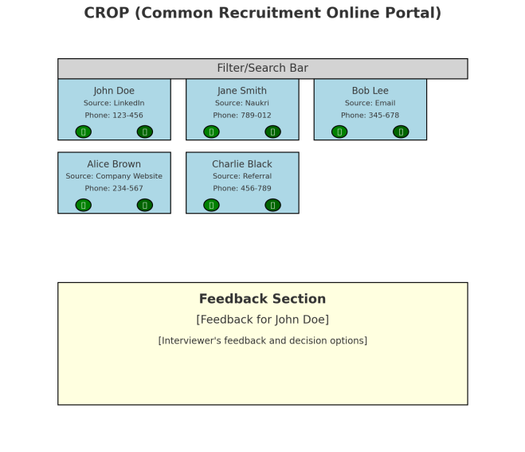

# CROP
Common Recruitment Online Portal

Idea is to create CROP ( common recruitment online portal ) app

We need to create a centralised dashboard where all the CVs can be shown at one single place in a grid format.

### Dashboard Overview

**1. Centralized CV Display:**  
  
• Grid Format  
• Each CV appears as a card in a grid format.  
• Cards display candidate name, photo (if available) & source      of CV (e.g., LinkedIn, Naukri, Company Website, Email).  
• A filter and search bar at the top for sorting and finding specific CVs.  

      

**2. Candidate Information:**  
  
• Contact Details:  
• Phone number and WhatsApp icon displayed prominently.  
• Clicking the phone icon triggers an automatic message setup for interview scheduling.  
      

**3. Interaction Features:** 
   
• Interview Scheduling:  
• Popup for selecting date and time for the interview when the   phone icon is clicked.   
• Automatic notifications sent to both the candidate and the interviewer.  
• Feedback System:  
• Interviewers can leave feedback directly on the dashboard.  
• Feedback section beneath each CV card.  
• HR can mark candidates for next round or rejection based on feedback.  
